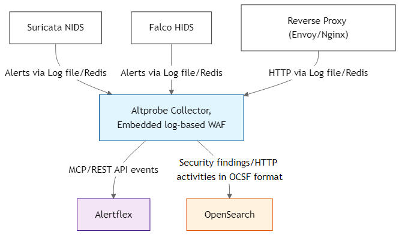

# Altprobe

Altprobe is a collector for monitoring and controlling API and MCP services.

It collects runtime and network events from sensors, normalizes them into OCSF, stores events in OpenSearch/ELK, and can additionally analyze them using an embedded log-based WAF.

## Overview

Altprobe is built for environments where API services and MCP servers, and service-to-service traffic need continuous visibility without deploying a full SIEM.



## Requirements

- **Operating System**: Ubuntu 20.04 or higher (for binary package)
- **Optional** (depending on configured sinks/sources):
  - OpenSearch / ELK stack
  - Redis
  - Falco, Suricata, or proxy logs from Nginx/Envoy

## Installation

### From DEB package

```bash
# Install system dependencies
sudo apt-get update
sudo apt-get -y install libyaml-cpp-dev libdaemon-dev libboost-all-dev libmodsecurity3

# Download the package
wget https://github.com/alertflex/altprobe/releases/download/v1.0.6/altprobe_1.0-6.deb

# Install the package
sudo dpkg -i altprobe_1.0-6.deb
sudo ldconfig
```

## Configure

Modify the file  `/etc/altprobe/altprobe.yaml` according to your configuration

## Run altprobe

```bash
altprobe-start   # start in daemon mode
altprobe-status  # check status
altprobe-stop    # stop altprobe
altprobe run     # start in cli mode
```

## Run container

```bash
docker run -d \
  --name altprobe \
  -v /var/log/:/var/host/:ro \
  -e ALTPROBE_ASSET_NAME="envoy" \
  -e ALTPROBE_LOG_DEBUG="true" \
  -e SINKS_OS_URL="https://192.168.1.X:9200" \
  -e SINKS_OS_USER="admin" \
  -e SINKS_OS_PWD="Password-12345" \
  -e SOURCES_PROXY_LOG="/var/host/envoy_access.log" \
  altprobe/altprobe:latest
```
