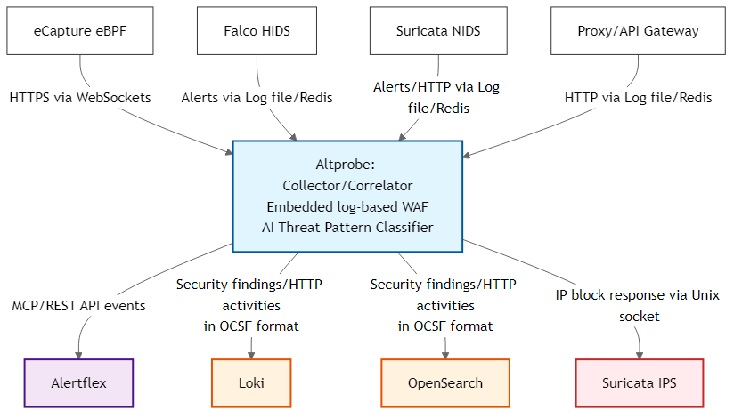

# Altprobe

Altprobe is a collector for monitoring and controlling API and MCP services.

It collects runtime and network events from sensors, normalizes them into OCSF, stores events in OpenSearch/Loki, and can additionally analyze them using an embedded log-based WAF that provides reactive protection through Suricata IPS.

## Overview

Altprobe is built for environments where API services, AI agents, MCP servers, and service-to-service traffic need continuous visibility without deploying a full SIEM.



## Requirements

- **Operating System**: Ubuntu 20.04 or higher (for binary package)
- **Optional** (depending on configured sinks/sources):
  - OpenSearch / ELK stack / Loki
  - Redis
  - eCapture, Falco, Suricata, proxy HTTP logs from APISIX/Envoy/OpenResty/Kong

## Installation

### From DEB package

```bash
sudo apt-get update

# Runtime dependencies for the current Altprobe build
sudo apt-get install -y \
    libdaemon0 \
    libboost-system1.74.0 libboost-filesystem1.74.0 libboost-regex1.74.0 \
    libboost-iostreams1.74.0 libboost-thread1.74.0 \
    libyaml-cpp0.7 libhiredis0.14 libmodsecurity3 libmaxminddb0 \
    libssl3 libwebsockets16

wget "https://github.com/olegzhr/altprobe/releases/download/v1.0.1/altprobe_1.0.1.deb"
sudo dpkg -i altprobe_1.0.1.deb
sudo ldconfig
```

## Configure

Modify the file  `/etc/altprobe/altprobe.yaml` according to your configuration

## Run altprobe

```bash
altprobe-start   # start in daemon mode
altprobe-status  # check status
altprobe-stop    # stop altprobe
altprobe run     # start in cli mode
```