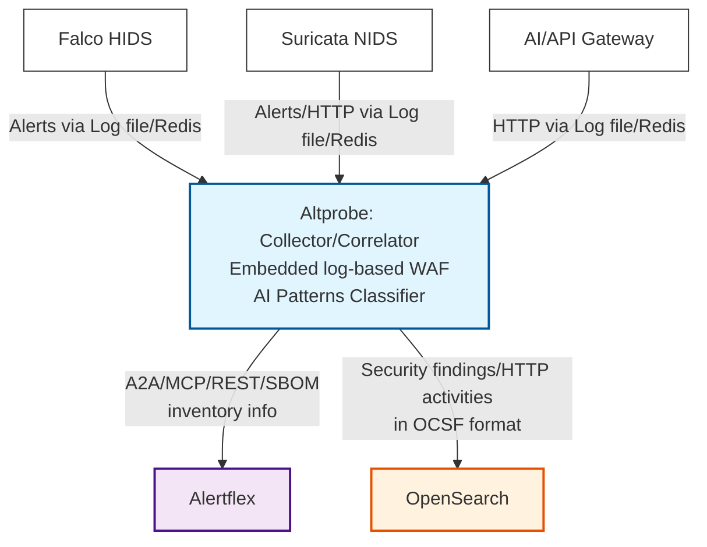
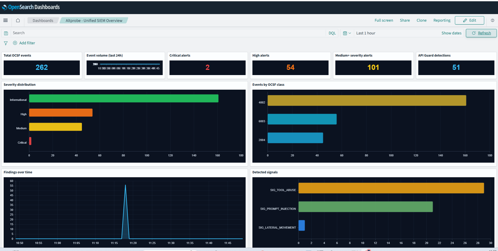

# Altprobe

Altprobe gives security and platform teams visibility into AI agent, MCP,
REST API, and gateway traffic without requiring every application to be
rewritten. It collects events from gateways, proxy logs, runtime sensors, and
network security tools, normalizes them into OCSF, and sends them to
OpenSearch or compatible downstream systems.

Altprobe is useful when you need to understand how AI agents and API services
interact in real environments: which tools are called, which routes are used,
which clients or sessions are involved, and which events should be reviewed by
security monitoring. It can be deployed next to an API gateway to start
collecting telemetry quickly, then extended with additional sources and sinks
as your environment grows.


```mermaid
flowchart TD
    HIDS[Falco HIDS] -->|Alerts via Log file/Redis| Altprobe
    NIDS[Suricata NIDS] -->|Alerts/HTTP via Log file/Redis| Altprobe
    Proxy["AI/API Gateway"] -->|HTTP via Log file/Redis| Altprobe

    Altprobe["Altprobe: Collector/Correlator<br/>Embedded log-based WAF<br/>AI Patterns Classifier"] -->|A2A/MCP/REST/SBOM<br/> inventory info| Alertflex[Alertflex]
    Altprobe -->|Security findings/HTTP activities<br/>in OCSF format| OpenSearch[OpenSearch]

    style NIDS fill:#ffffff,stroke:#333,stroke-width:1px
    style HIDS fill:#ffffff,stroke:#333,stroke-width:1px
    style Proxy fill:#ffffff,stroke:#333,stroke-width:1px
    style Altprobe fill:#e1f5fe,stroke:#01579b,stroke-width:2px
    style Alertflex fill:#f3e5f5,stroke:#4a148c,stroke-width:2px
    style OpenSearch fill:#fff3e0,stroke:#e65100,stroke-width:2px
```

## Components
| Component | Role | Direction |
|-----------|------|-----------|
| Falco (HIDS) | Host intrusion detection | → Altprobe (log/Redis) |
| Suricata (NIDS) | Network intrusion detection | → Altprobe (log/Redis) |
| AI/API Gateway | APISIX / Envoy / Kong fronting MCP, A2A, REST | → Altprobe (log/Redis) |
| Altprobe Core | Collects, correlates, classifies, normalizes to OCSF | core |
| OpenSearch | Search, dashboards, alerting | ← Altprobe (OCSF) |
| Alertflex | Inventory & SBOM context (optional) | ← Altprobe (A2A/MCP/REST) |

## Example Screenshots

The quick-start labs provision OpenSearch Dashboards so you can inspect
normalized OCSF events, agent correlations, and security timelines.

### Unified SIEM Overview



### Agent Correlations


### MITRE ATT&CK / ATLAS Timeline


## Why Use Altprobe

- Monitor MCP, AI Gateway, and REST API traffic from a single collector.
- Convert heterogeneous gateway and sensor events into OCSF.
- Send normalized events to OpenSearch for search, dashboards, and alerting.
- Correlate API and agent activity by host, session, route, and request data.
- Start with a local lab, then adapt the same source and sink pattern for a
  production gateway.

## Repository Contents

- `docker/` - base Docker assets for Altprobe.
- `ids-rules/` - example IDS rule files.
- `labs/` - public quick-start labs for APISIX, Envoy, and Kong.

## Requirements

- Docker and Docker Compose for the labs.
- Ubuntu 20.04 or newer for the Linux package install path.
- Optional: OpenSearch or another supported sink for production deployments.

## Install From Package

```bash
sudo apt-get update
sudo apt-get install -y \
    libdaemon0 \
    libboost-system1.74.0 libboost-filesystem1.74.0 libboost-regex1.74.0 \
    libboost-iostreams1.74.0 libboost-thread1.74.0 \
    libyaml-cpp0.7 libhiredis0.14 libmodsecurity3 libmaxminddb0 \
    libssl3 libwebsockets16

ALTPROBE_VERSION=1.0.2
ALTPROBE_RELEASE_BASE_URL="https://github.com/olegzhr/altprobe/releases/download"
wget "${ALTPROBE_RELEASE_BASE_URL}/v${ALTPROBE_VERSION}/altprobe_${ALTPROBE_VERSION}.deb"
sudo dpkg -i "altprobe_${ALTPROBE_VERSION}.deb"
sudo ldconfig
```

Update `/etc/altprobe/altprobe.yaml` for your sources and sinks.

## Run Altprobe

```bash
altprobe-start
altprobe-status
altprobe-stop
altprobe run
```

## Quick-Start Labs

The public labs are designed for safe local evaluation. They use harmless mock
traffic only: MCP ping/tool calls, REST demo endpoints, and a local
OpenAI-compatible response mock.

### Quickest Path

If you are not sure which gateway to try first, start with APISIX:

```bash
cd labs/lab_apisix
docker compose build
docker compose up -d
cd tests
LAB_BASE=http://localhost:9080 bash 01_smoke.sh
LAB_BASE=http://localhost:9080 bash 02_opensearch_smoke.sh
```

Expected result: both smoke scripts print `PASS`. Then open OpenSearch
Dashboards at `http://localhost:5601` and review the provisioned Altprobe
dashboards.

Use the same flow for any gateway:

```bash
cd <lab-directory>
docker compose build
docker compose up -d
cd tests
LAB_BASE=<gateway-url> bash 01_smoke.sh
LAB_BASE=<gateway-url> bash 02_opensearch_smoke.sh
```

| Gateway | Lab directory | Gateway URL | Details |
|---------|---------------|-------------|---------|
| APISIX | `labs/lab_apisix` | `http://localhost:9080` | `labs/lab_apisix/README.md` |
| Envoy | `labs/lab_envoy` | `http://localhost:9080` | `labs/lab_envoy/README.md` |
| Kong | `labs/lab_kong` | `http://localhost:8010` | `labs/lab_kong/README.md` |

All labs expose OpenSearch at `http://localhost:9200` and OpenSearch Dashboards
at `http://localhost:5601`.
