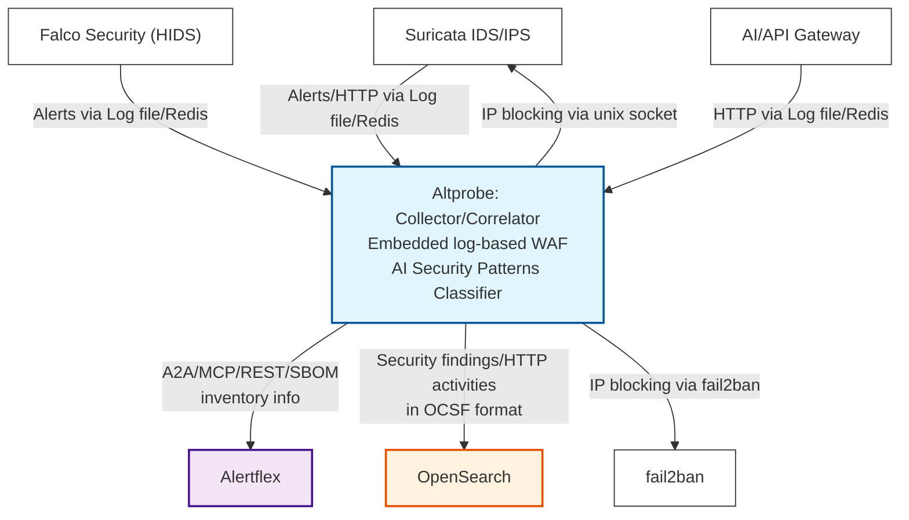
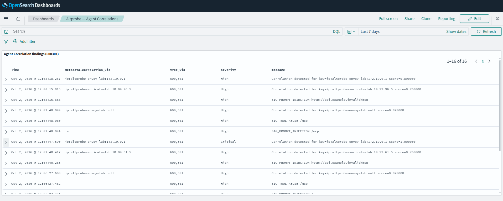
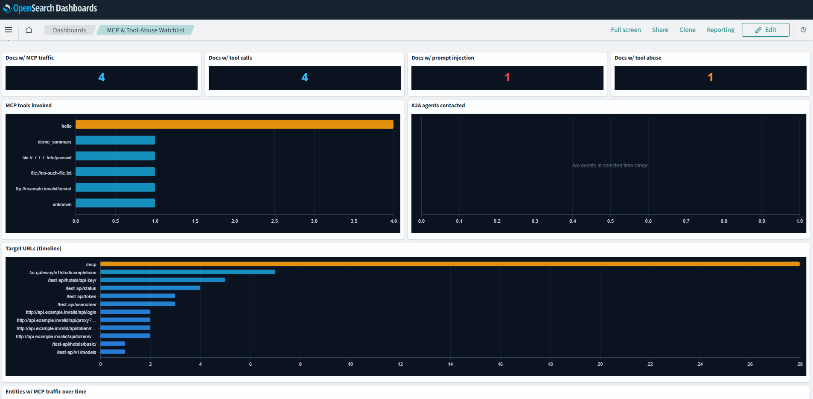
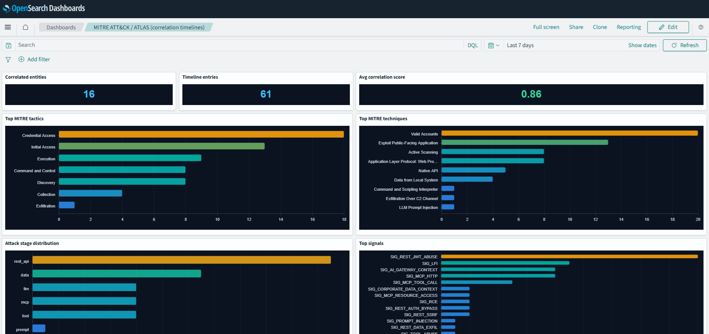

# Altprobe

Altprobe gives security and platform teams visibility into AI agent, MCP, REST API, and gateway traffic. It collects events from gateways, proxy logs, runtime sensors, and network security tools, normalizes them into OCSF, and sends them to OpenSearch or compatible downstream systems.

If your SIEM or a similar system does not cover A2A, MCP, or AI-agent traffic, Altprobe can be used alongside it. It reads existing gateway and sensor logs, discovers AI agents, MCP servers, and APIs (including undocumented ones), identifies threats based on OWASP Top 10, and correlates them by MITRE ATT&CK / ATLAS — without deploying a full SIEM.

## Table of Contents

- [Architecture](#architecture)
- [Components](#components)
- [Example Screenshots](#example-screenshots)
  - [Solution Overview](#solution-overview)
  - [Agent Correlations](#agent-correlations)
  - [MITRE ATT&CK / ATLAS Timeline](#mitre-attck--atlas-timeline)
- [Why Use Altprobe](#why-use-altprobe)
- [Automated IP Blocking](#automated-ip-blocking)
- [Repository Contents](#repository-contents)
- [Requirements](#requirements)
- [Install From Package](#install-from-package)
- [Run Altprobe](#run-altprobe)
- [Quick-Start Labs](#quick-start-labs)
  - [Quickest Path](#quickest-path)
- [License](#license)

## Architecture


```mermaid
flowchart TD
    NIDS["Suricata IDS/IPS"] -->|Alerts/HTTP via Log file/Redis| Altprobe
    HIDS["Falco Security (HIDS)"] -->|Alerts via Log file/Redis| Altprobe
    Proxy["AI/API Gateway"] -->|HTTP via Log file/Redis| Altprobe

    Altprobe["Altprobe: Collector/Correlator<br/>Embedded log-based WAF<br/>AI Security Patterns Classifier"] -->|A2A/MCP/REST/SBOM<br/> inventory info| Alertflex[Alertflex]
    Altprobe -->|Security findings/HTTP activities<br/>in OCSF format| OpenSearch[OpenSearch]

    Altprobe -->|IP blocking via unix socket| NIDS
    Altprobe -->|IP blocking via fail2ban| Fail2ban["fail2ban"]

    style NIDS fill:#ffffff,stroke:#333,stroke-width:1px
    style HIDS fill:#ffffff,stroke:#333,stroke-width:1px
    style Proxy fill:#ffffff,stroke:#333,stroke-width:1px
    style Altprobe fill:#e1f5fe,stroke:#01579b,stroke-width:2px
    style Alertflex fill:#f3e5f5,stroke:#4a148c,stroke-width:2px
    style OpenSearch fill:#fff3e0,stroke:#e65100,stroke-width:2px
    style Fail2ban fill:#ffffff,stroke:#333,stroke-width:1px
```

## Components
| Component | Role | Direction |
|-----------|------|-----------|
| Falco (HIDS) | Host intrusion detection | Altprobe (log/Redis) |
| Suricata (NIDS) | Network intrusion detection | Altprobe (log/Redis) |
| Suricata (IPS) | IP blocking | Altprobe (unix socket) |
| Fail2ban | Alternative IP blocking | Altprobe (fail2ban-client) |
| AI/API Gateway | APISIX / Envoy / Kong fronting MCP, A2A, REST | Altprobe (log/Redis) |
| Altprobe | Collects, correlates, classifies, normalizes to OCSF, WAF | Core |
| OpenSearch | Search, dashboards, alerting | Altprobe (OCSF) |
| Alertflex | Inventory & SBOM context (optional) | Altprobe (A2A/MCP/REST) |

## Example Screenshots

The quick-start labs provision OpenSearch Dashboards so you can inspect
normalized OCSF events, agent correlations, and security timelines.

### Altprobe - Agent Correlations



### MCP & Tool-Abuse Watchlist



### MITRE ATT&CK / ATLAS Timeline



## Why Use Altprobe

- Monitor MCP, AI Gateway, and REST API traffic from a single collector.
- Convert heterogeneous gateway and sensor events into OCSF.
- Send normalized events to OpenSearch for search, dashboards, and alerting.
- Correlate API and agent activity by host, session, route, and request data.
- Start with a local lab, then adapt the same source and sink pattern for a
  production gateway.

## Automated IP Blocking

Altprobe can automatically block source IPs after HIGH or CRITICAL correlated
findings, independently of whether OpenSearch or Alertflex delivery is enabled.
Two backends are supported:

- **Suricata** — Altprobe adds a hostbit over the Suricata Unix socket.
- **fail2ban** — Altprobe bans the IP through `fail2ban-client` in a dedicated
  jail. It sets the jail ban time from the configured timeout and then bans the
  IP; fail2ban removes the block automatically when the timeout expires.

For the fail2ban backend, fail2ban must be installed on the host with a jail
reserved for Altprobe, and `fail2ban-client` must be available. Blocking is
guarded by an IP allowlist (your own and infrastructure addresses) and a
per-minute ban limit.

## Repository Contents

- `docker/` - base Docker assets for Altprobe.
- `ids-rules/` - MCP / Shadow API / AI Detection rule files for Falco, Suricata.
- `labs/` - public quick-start labs for APISIX, Envoy, and Kong.

## Requirements

- Docker and Docker Compose for the labs.
- Ubuntu 22.04 (the package versions below are pinned for this release) for the
  Linux package install path.
- Optional: OpenSearch or another supported sink for production deployments.

## Install From Package

```bash
sudo apt-get update
sudo apt-get install -y \
    libdaemon0 \
    libboost-system1.74.0 libboost-filesystem1.74.0 libboost-regex1.74.0 \
    libboost-iostreams1.74.0 libboost-thread1.74.0 \
    libyaml-cpp0.7 libhiredis0.14 libmodsecurity3 libmaxminddb0 \
    libssl3 libwebsockets16

ALTPROBE_VERSION=1.0.2
ALTPROBE_RELEASE_BASE_URL="https://github.com/olegzhr/altprobe/releases/download"
wget "${ALTPROBE_RELEASE_BASE_URL}/v${ALTPROBE_VERSION}/altprobe_${ALTPROBE_VERSION}.deb"
sudo dpkg -i "altprobe_${ALTPROBE_VERSION}.deb"
sudo ldconfig
```

Update `/etc/altprobe/altprobe.yaml` for your sources and sinks.

## Run Altprobe

```bash
altprobe-start
altprobe-status
altprobe-stop
altprobe run
```

## Quick-Start Labs

The public labs are designed for safe local evaluation. They use harmless mock
traffic only: MCP ping/tool calls, REST demo endpoints, and a local
OpenAI-compatible response mock.

### Quickest Path

If you are not sure which gateway to try first, start with APISIX:

```bash
cd labs/lab_apisix
docker compose build
docker compose up -d
cd tests
LAB_BASE=http://localhost:9080 python3 run_tests.py smoke
```

Expected result: the smoke suite prints `PASS`. Then open OpenSearch
Dashboards at `http://localhost:5601` and review the provisioned Altprobe
dashboards.

Use the same flow for any gateway:

```bash
cd <lab-directory>
docker compose build
docker compose up -d
cd tests
LAB_BASE=<gateway-url> python3 run_tests.py smoke
```

| Gateway | Lab directory | Gateway URL | Details |
|---------|---------------|-------------|---------|
| APISIX | `labs/lab_apisix` | `http://localhost:9080` | `labs/lab_apisix/README.md` |
| Envoy | `labs/lab_envoy` | `http://localhost:9080` | `labs/lab_envoy/README.md` |
| Kong | `labs/lab_kong` | `http://localhost:8010` | `labs/lab_kong/README.md` |

All labs expose OpenSearch at `http://localhost:9200` and OpenSearch Dashboards
at `http://localhost:5601`.

## License

See [LICENSE](LICENSE).
